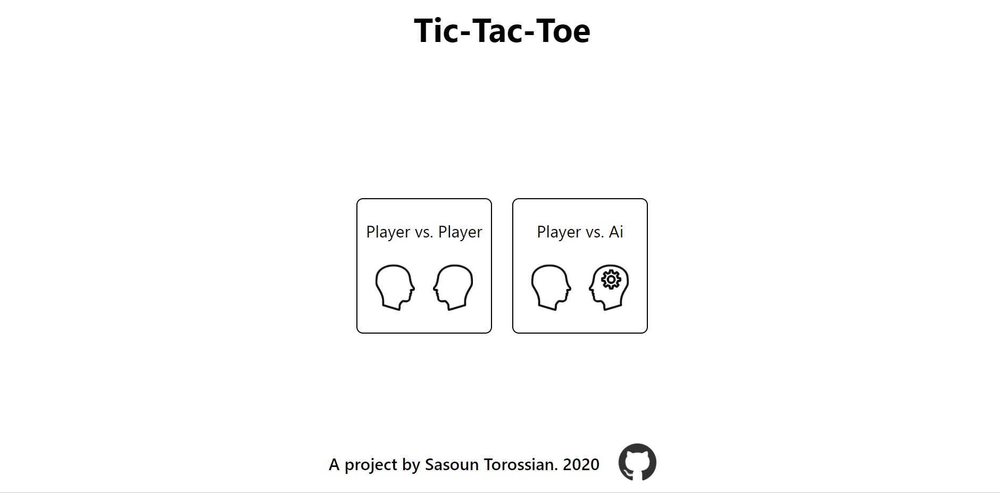

# Tic-Tac-Toe
Tic-tac-toe game based off the Odic Project curriculum. Allows for player 1 vs player 2, or player 1 vs AI. AI has three difficulty levels. Live demo can be found on github.io [here](https://sasountorossian.github.io/Tic-Tac-Toe/).



First introduction to modules and factory, as such tried to implement them in as clean a way as possible. Decided to have a GameEngine module to synchronize Players, AI, and Game Board objects.
Generally works well though animations could be better.

Happy with elegent solution to finding winning combination on board via higher order functions. I.e. For "X" tiles: 

```javasscript
let player1Win = winningCombos.some(arr => arr.every(el => gameBoardArray[el] == "X")) 
```

AI is implemented using minimax algorithm to recursively iterate through all possible moves. In order to speed up algorithm, alpha-beta pruning was used to discard unnecessary recursion.
AI difficulty was implemented by using randomy generated value within a certain range to negatively weigh the final minimax score. Lower difficulty ratings divide score by 0.1-0.2, while
harder modes divide by 0.9-1.0.

Animations were an afterthought, and required some modification to implement properly. Required the creation of a new Options Menu module to control the fade-in and fade-out of various elements.

Good project for introduction to factories and modules, with the AI being particularly fun to implement. Next time however, would consider animations earlier in design phase.
